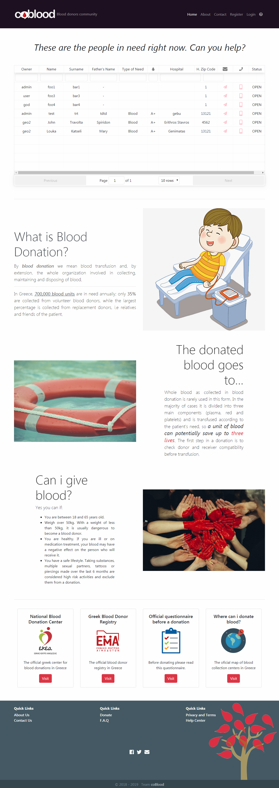
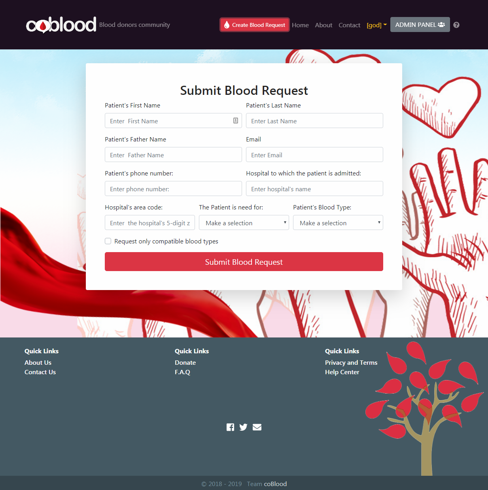

# AFDEMP_CB6_TeamProject

This is a single page web application based on Java and React, that was produced for the completion of the AFDEMP Coding Bootcamp 6.

**Technologies and programmings languages used:**
**Back End:** Java, Spring MVC
**Database:** MySQL
**Front-End:** React, Bootstrap, JQuery, Javascript, HTML, CSS

**Landing page: **

**The page where the user add a new blood request to the system:**

